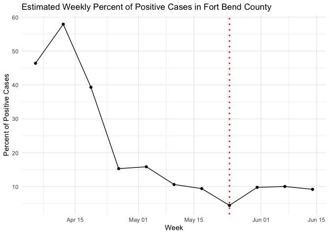

COVID-19 in Fort Bend County
================
Karla Mejia
6/18/2020

Data Source:
<https://covid-19-fort-bend-county-response-fbcgis.hub.arcgis.com/>

The Fort Bend County Community Impact Dashboard reports the daily total
of positive COVID-19 cases by reported date as well as the daily total
of tests conducted by the county. The daily percent of positive cases is
not provided but would be informative to consider.

It is unclear from the dashboard whether the reported positive cases
include cases that were determined through tests not conducted by the
county (e.g. tests conducted at a hospital or clinic). It is also
unclear when the tests for the positive cases were conducted since the
dashboard only displays the reported case date. That is why the data
were aggregated to obtain 7-day moving averages and the percent of
positive cases derived from them considered a proxy for the true percent
of positive cases.

## Total Tests and Total Positive Cases

Phase I of reopening Texas coincided with Memorial Day. The surge in
testing before Memorial Day weekend may be due to employers requesting
that employees prove they do not have COVID-19 before returning to work.

<!-- -->

## Estimated Percent of Positive Cases

Before Memorial Day, the percent of positive cases decreased steadily as
testing increased from over 50% down to 5%. After Memorial Day, the
percent of positive cases increased to 10%.

<!-- -->
