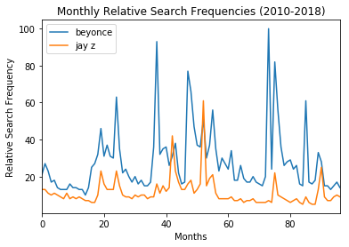
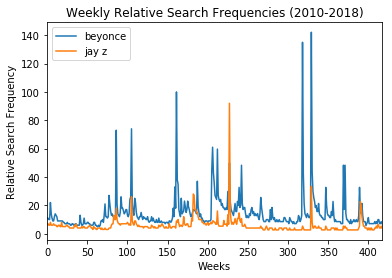

## Example 1
You can use `getRelatedQueries` to get a list of the top related queries for one search term.

__Code:__
```python
# Import methods
%matplotlib inline
from google_trends import *
```
```python
getRelatedQueries(keywords = ['wrestlemania'], 
                  interval = '2016-01-01 2018-01-01', 
                  country_id = 'US')
```

__Output:__


    ['wrestlemania 32',
     'wrestlemania 33',
     'wwe',
     'wwe wrestlemania',
     'wwe wrestlemania 32',
     'wwe wrestlemania 33',
     'wrestlemania results',
     'wrestlemania 2017',
     'undertaker',
     'undertaker wrestlemania',
     '2016 wrestlemania',
     'wrestlemania tickets',
     'wrestlemania time',
     'wrestlemania 34',
     'wrestlemania matches',
     'wrestlemania 31',
     'john cena',
     'wrestlemania 32 results',
     'wrestlemania 30',
     'wrestling',
     'wrestlemania card',
     'roman reigns',
     'wwe wrestlemania 2016',
     'triple h',
     'when is wrestlemania']


## Example 2
You can use `getRelatedQueries` to get a list of the top related queries for multiple search terms.

__Code:__
```python
getRelatedQueries(keywords = ['michael scott', 'dwight schrute'], 
                  interval = '2014-01-01 2018-01-01', 
                  country_id = 'US')
```

__Output:__


    ['michael scott office',
     'michael scott the office',
     'the office',
     'michael scott quotes',
     'michael scott gif',
     'michael scott no no no',
     'michael scott foster',
     'no michael scott',
     'michael scott no',
     'michael scott quote',
     'michael scott meme',
     'michael james scott',
     'david michael scott',
     'no michael scott gif',
     'michael jordan',
     'michael scott movie',
     'michael jackson',
     'dr michael scott',
     'michael scott toby',
     'michael kors',
     'michael scott no no gif',
     'steve carell',
     'the office quotes',
     'chad michael murray',
     'walter scott',
     'dwight schrute quotes',
     'dwight quotes',
     'dwight schrute the office',
     'dwight the office',
     'rainn wilson',
     'dwight meme',
     'michael scott',
     'dwight schrute meme',
     'dwight schrute memes',
     'dwight schrute costume',
     'dwight schrute gif',
     'jim halpert',
     'dwight schrute funny',
     'dwight schrute quote',
     'office quotes',
     'dwight schrute bobblehead',
     'dwight schrute birthday',
     'dwight schrute shirt',
     'dwight schrute christmas',
     'dwight from the office',
     'dwight shrute',
     'dwight howard']


## Example 3
You can use `getTrends` to get a pandas dataframe of the relative search frequencies over the time interval of your choice. 

__Note:__
The public Google Trends API automatically selects the frequency of the data based on the length of the interval. As shown below, the Google Trends API returns monthly data for intervals longer than five years. Check out the next example to see how to obtain weekly data for intervals longer than 5 years.

__Code:__
```python
# Get trends using one time interval
trends = getTrends(['beyonce', 'jay z'], ['2010-01-01 2018-01-01'], 'US') 
trends.head()

```
```python
p = trends.plot(title='Monthly Relative Search Frequencies (2010-2018)')
p.set_xlabel('Months')
p.set_ylabel('Relative Search Frequency')
```

__Output:__


<div>
<table border="1" class="dataframe">
  <thead>
    <tr style="text-align: right;">
      <th></th>
      <th>date</th>
      <th>beyonce</th>
      <th>jay z</th>
    </tr>
  </thead>
  <tbody>
    <tr>
      <th>0</th>
      <td>2010-01-01</td>
      <td>21</td>
      <td>13</td>
    </tr>
    <tr>
      <th>1</th>
      <td>2010-02-01</td>
      <td>27</td>
      <td>13</td>
    </tr>
    <tr>
      <th>2</th>
      <td>2010-03-01</td>
      <td>23</td>
      <td>11</td>
    </tr>
    <tr>
      <th>3</th>
      <td>2010-04-01</td>
      <td>17</td>
      <td>10</td>
    </tr>
    <tr>
      <th>4</th>
      <td>2010-05-01</td>
      <td>18</td>
      <td>11</td>
    </tr>
  </tbody>
</table>
</div>





## Example 4
You can use `getTrends` to get a pandas dataframe of the relative search frequencies over the time interval of your choices. To obtain weekly data for intervals longer than five year, you can split up the original interval into shorter intervals that overlap by one week so that the `getTrends` method can calculate the ratio between the relative search frequencies from overlapping week to rescale and concatenate the resulting trends.


__Code:__
```python
trends = getTrends(['beyonce', 'jay z'], ['2010-01-01 2014-01-10', '2014-01-05 2018-01-01'], 'US') 
trends.head()
```

```python
p = trends.plot(title='Weekly Relative Search Frequencies (2010-2018)')
p.set_xlabel('Weeks')
p.set_ylabel('Relative Search Frequency')
```

__Output:__


<div>
<table border="1" class="dataframe">
  <thead>
    <tr style="text-align: right;">
      <th></th>
      <th>date</th>
      <th>beyonce</th>
      <th>jay z</th>
    </tr>
  </thead>
  <tbody>
    <tr>
      <th>0</th>
      <td>2010-01-03</td>
      <td>11.0</td>
      <td>7.0</td>
    </tr>
    <tr>
      <th>1</th>
      <td>2010-01-10</td>
      <td>11.0</td>
      <td>7.0</td>
    </tr>
    <tr>
      <th>2</th>
      <td>2010-01-17</td>
      <td>10.0</td>
      <td>6.0</td>
    </tr>
    <tr>
      <th>3</th>
      <td>2010-01-24</td>
      <td>10.0</td>
      <td>6.0</td>
    </tr>
    <tr>
      <th>4</th>
      <td>2010-01-31</td>
      <td>22.0</td>
      <td>8.0</td>
    </tr>
  </tbody>
</table>
</div>




